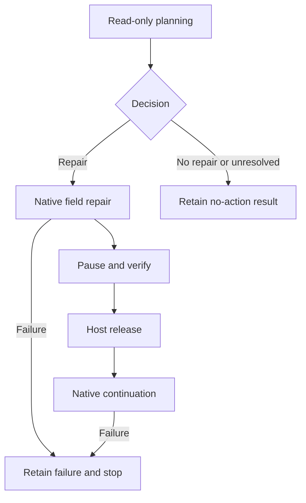

# Frozen provider profiles and explicit native phases

The current engineering entry is `PhasedPlanningRepairEntry`, registered in `configs/stage2_monitor_repair_active.json`. It replaces the prior one-call entry for current work; it has no fallback to that entry. Earlier code and datasets remain only to reproduce immutable predecessor evidence. This version is an **offline preflight**, not a live model trial or a repair-effectiveness result.

## Provider configuration and evidence

`freeze_provider_bindings` checks hashes of the original subject/model files, tasks, roles, provider implementation, software host, official MCP integration files and native resume loop. The planning and subject profiles retain the configured DeepSeek alias, expected version, temperature, thinking mode and token limit. No studied framework or protocol source is modified.

The planning profile has a separate 16-call ceiling. The subject profile derives its ceiling from the restored parent's remaining horizon: sequence 4 of a 64-decision native horizon leaves 60 decisions. This is neither a budget reset nor an increase. The earlier subject configuration's nominal 32-turn field does not override the captured prospective host's already-frozen 64-decision horizon. Exact historical provider-attempt counts are missing; four captured native decisions cannot be relabeled as exactly four historical API requests.

Each prepared request permits one transport attempt and no JSON-format resampling. These stricter first-attempt bounds are explicit in the new preflight configuration; they do not rewrite historical retry policies or evidence. The original decoding parameters and native host ceiling remain unchanged. An attempted failure is retained and closes the exchange source without refund, fallback or automatic replay.

`BoundExchangeSource` saves the exact request body before dispatch and the exact response body before decoding. It records status, source hashes, native role/turn metadata and non-secret content-type/accept headers. Raw response fields and message content are preserved. Reported model drift, HTTP/application failures, duplicate fields and incomplete responses stop the source. Malformed model content is passed through unchanged for the original native parser; it is not repaired or resampled by the provider adapter. Non-UTF-8 failure bytes remain readable through their exact hexadecimal representation in the graph capture and their original byte artifact.

Only `OfflineWireResponses` is currently accepted. Its HTTP-shaped bytes are fixed fixtures, not a network exchange or a backend identity measurement. Credentials are neither read nor stored. `PlanningRequestAdapter` checks the parent, graph, original task and call budget before encoding the existing complete planning request as model messages. The encoding test does not generate the scripted repair proposal, and the sealed planning loop still rejects this adapter as a live actor.

Configured version `DeepSeek-V4.1-Flash` is a frozen repository expectation. A configured name or a fixture response bearing that name is not proof of the actual backend version. `live_trial_ready` remains false.

## Current host phases



| Phase | Checked condition | Subject exchange permission |
| --- | --- | --- |
| `plan_and_repair` | Closed host-bound planning session; source-revalidated exact authorization; frozen provider identity/budget inputs | None |
| Repaired and paused | Native reads/writes/post-read checks and bound host checks complete; original queue/inbox/history/task/ceiling preserved | None |
| `release` | Same retained planning object and authorization; tools revoked; all ordered steps complete; source/app/host bindings unchanged | Records a host release, without calling the subject |
| `continue_native` | Exact host release exists; original state/budgets still match; first continuation attempt | Existing native prompt construction and resume loop, within the unchanged remaining horizon |
| No action | `NO_REPAIR_NEEDED` or `UNRESOLVED`; no authorization | No native branch or runtime construction |
| Failure | Partial records, failed state and full native failure checkpoint retained | No replay |

Calling the subject source or continuation before release fails before an exchange is attempted. Repair itself does not pop the queue, clear an inbox, append native history or spend a subject decision. Phase separation is a host execution boundary, not an additional actor permission request.

The host release records `OFFLINE_REPAIR_DRIVER_EXIT`. It is never `REPAIR_AGENT_EXIT`. Neither a proposal submission nor a JSON field saying “I exited” certifies that an actual repair actor finished its authorized native work. The unchanged semantic criteria still require actual exit, ordered post-exit subject observations, old C/P authority, historical re-entry, transformed descendants and unrelated progression to be evaluated independently. Literal version retention is not semantic-effect evidence.

## Reproduction and remaining work

Use the original frozen official MCP SDK interpreter:

```bash
"$SDK_ROOT/.venv/bin/python" scripts/check_stage2_provider_phase.py \
  --source-root "$SOURCE_ROOT" --sdk-root "$SDK_ROOT" --protocol-root "$PROTOCOL_ROOT" \
  --out "$FRESH_OUTPUT" --compare-frozen
```

Evidence is separately sealed in `stage2/replication_v2/bound_provider_phase_preflight_v1`. It includes the paused state/graph, blocked pre-release calls, host release, exact offline provider exchanges, full native continuation captures, native checkpoints and negative provider cases. Previous seals remain unchanged.

Pending work is the live HTTP transport driver with the same per-attempt capture, its binding into the planning session, evidence-supported semantic entry selection, host verification of actual repair-agent exit, live subject continuation and independent semantic review. No natural trajectory rerun, branch promotion or automatic paid reviewer is enabled. X5–X7 still require separate native bindings.
