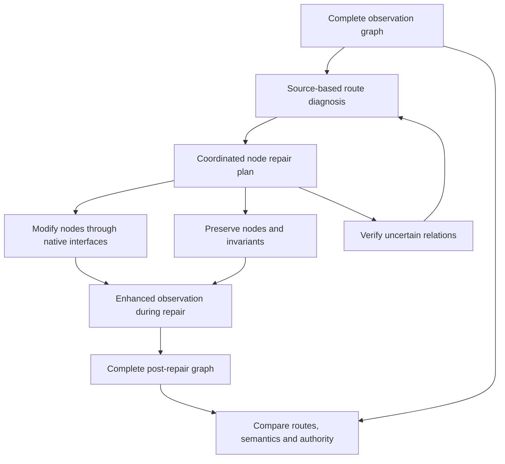

# Complete node-route repair: replacement design

Status: source-context preparation, an offline field-bounded application branch, and a source-based manual application/current-host-answer coordinated branch are implemented. Complete plans are recorded before the first write, with field restrictions, dependencies, native receipts and full graph capture. Agent-generated semantic diagnosis/planning, message or private-state bindings, native agent continuation, branch promotion and a fair live comparison are not ready. Live execution remains disabled. Machine-readable state: `configs/stage2_node_route_repair_design_v1.json`.

The source-based integration is a manual engineering check on one copied frozen checkout. It identifies captured frontend changes versus a contradictory terminal account, and separately checks a conditional alternate launcher. The documented direct service route works before repair. Unknown historical launcher use and downstream semantic adoption remain unknown. See [source-based branch report](../reports/2026-10-03_Source_Based_Application_Host_Branch.md).

Implementation details and verified limits: [Field-bounded branch repair](StageII_Field_Bounded_Branch_Repair.md). The new executor replaces local-package execution for this offline branch path; it does not route plans through the legacy terminal revision harness. It makes no model call and imports no private product code.

A read-only [inspected-source proposal compiler](StageII_Inspected_Route_Planning.md) now validates exact endpoint witnesses, task/parent bindings, route roles, diagnosis-to-action references and separately retained host field policies. Its offline manual receipt compiles a seven-node route without executing actions or adjudicating semantics. This is a planning interface prerequisite; it is not an agent-generated diagnosis.

## Correction of the previous attempt

The terminal harness was run before the planned repair method existed. It added enhanced graph queries to diagnosis but restricted repair to one terminal process-account revision, reused the old local revision executor, attached the old structural watcher to continuation, and exported only a post-action delta. This was not the proposed complete node-route repair system.

Its 21 calls and four branch outcomes remain immutable diagnostic-harness records. They must not be presented as the first evaluation of the new repair method, as evidence that node-route repair failed, or as a substitute for implementing the method. No native repair action occurred. Archive-path confusion was one observable usability problem; it was not the whole design failure.

The current CLI and provider builder reject live execution. The old workflow has been replaced by offline preparation/validation only, without a paid execution input, commit marker or provider secret. Historical execution source is archived by exact hash so the old traces remain verifiable after disabling that entrypoint.

## What the repair agent must receive

The input is the complete observed graph and original coding task, with stable access to exact native evidence. It is not a candidate list, a small alert package, a depth-limited subgraph or a terminal answer alone. All nodes remain available; the agent can select a relevant route while retaining access to alternative routes and the rest of the context.

Each node must expose its native source, version/hash, actor/interface, clock, relevant observations and recorded relations. Application nodes additionally expose an exact terminal checkpoint member and prior captured file versions. Distinct clocks remain distinct; a checkpoint-ledger order does not establish the order of independent native clocks. A structural eligibility annotation is not a new native capture.

The implemented `CompleteRouteContext` supplies exact file-ref → checkpoint → source-member mappings, captured versions, native-source lookup and full node context. It preserves original task text, includes no semantic-audit verdict and confers no write authority. The preparation CLI emits the complete graph artifact alongside its source catalog. This solves one prerequisite; it does not create a repair plan.

## Required operation

### 1. Diagnose the route before choosing actions

Diagnosis must identify what changed meaning/status, which source and descendant carry it, where it was used, and what operational authority followed. Compare historical actions with later accounts; endpoint correctness alone is insufficient. Proposals cite native records and captured state, rather than inheriting frozen evaluator labels. Unknown adoption/causal relations remain verification tasks until supported.

For the MCP example, terminal feature presence does not explain why a later account describes no change after captured file versions changed. The source context makes the sequence-10 before/after versions inspectable. A diagnosis still has to connect those observations to the later account. The harness must not prewrite that diagnosis into the agent's input.

### 2. Produce a coordinated plan over the full graph

The plan binds the graph, parent checkpoint, original task and inspected source versions. It specifies route nodes, supported/unknown relations, nodes to modify/preserve/verify, reasons, native actions, action dependencies and expected postconditions. It must explain how actions jointly affect the route, including downstream inherited state or obligations where appropriate. Listing multiple objects or iterating local repair packages does not constitute a coordinated plan.

The planning view is global; actual writes follow the diagnosed plan and original task. The original broad coding request must not be replaced by blanket file preservation or account-only permission. Studied frameworks, foreign private state and historical messages remain immutable. Where an original interface supports a forward revision/supersession, bind the new state to its predecessor rather than rewriting the old record. Unsupported relations do not automatically authorize writes.

### 3. Validate and execute the plan through native capabilities

Before the first action, verify the parent, current versions, task scope, available native operations, preserve invariants, action ordering and expected postconditions for the whole plan. A native executor must consume the plan, not translate it back into the old single-point alert package. It must support the frozen action classes and multi-node ordering, record each before/after native receipt, stop on a stale version or failed dependency, and retain partial-execution evidence without hidden rollback or replay.

Native access helpers may be reused where they preserve the studied interface. The old intervention strategy must not be reused as a fallback. A single process-account instruction may be one justified action in a larger plan; it cannot stand in for the entire route plan by default. FULL_NATIVE restoration remains a prerequisite for live native continuation.

The implemented offline application path uses a separate host-held field policy and compiles ordered, exact operations. It copies the terminal application into a new branch, preserves the historical graph and archive, executes through `HostCheckout.write_file`, and records both successful and failed writes. JSON operations replace existing scalar leaves; text operations replace one exact source-bound span per object. Multiple JSON leaves in one object require explicit ordering and projected intermediate file hashes. This is application-state integration, not proof of historical pressure-point resumption, semantic repair success, native model continuation or concurrent isolation.

### 4. Keep the enhanced monitor attached throughout

Capture the graph before repair, native actions and state changes during repair, and the complete graph after the repair agent exits. The monitor remains external and read-only; the repair executor performs authorized writes through native interfaces. The upgraded evidence adapter must ingest the new native captures and preserve their source/version/clock bindings. The old structural watcher can supply a historical comparison, but cannot be presented as the complete enhanced monitor.

The post-repair artifact must contain the full available graph, not just a file delta or final answer. Preserve unsupported/unknown edges, missing evidence and failed boundaries. Graph updates append new observations and version links without manufacturing semantic dependence.

### 5. Freeze the comparison only after the method is ready

Use the same within-case parent and original task for local and node-route methods. Both methods need functioning native execution and before/after capture; the treatment cannot be a graph-query interface with the same incomplete local intervention underneath. Healthy-route preservation is an outcome to diagnose, not a case-specific permission that tells the agent in advance to make no changes.

Freeze cases, methods, budgets and outcome rules after offline integration checks have receipts. A later paid trial is a separately specified evaluation, not a rerun to replace the premature diagnostic records. No natural subject is rerun. Existing frozen audits can inform case selection/evaluation but cannot enter graph-agent inputs. Outcome evaluation separately examines process semantics/authority, application behavior, preserve invariants and repair boundaries.

## Readiness and immediate order

| Requirement | Current state | Evidence needed before live execution |
| --- | --- | --- |
| Complete graph and source/version navigation | Implemented for the two frozen preparation cases | Exact source catalog and hash/version checks |
| Route-level semantic diagnosis | One source-based manual candidate; agent diagnosis missing | Native-source witnesses with unknown relations retained |
| Coordinated multi-node plan | Manual application/current-answer plan and application compiler implemented; agent plan generation missing | Source-based diagnosis and semantic dependency decisions |
| Native plan executor | Application fields and experiment-owned current host answer implemented offline | Message/private-state boundaries and model continuation |
| Enhanced monitoring before/during/after | Application, route probes and current-host branch capture implemented | Entire continued native agent run capture |
| Complete post-repair route comparison | Full graph preservation and mechanical state comparison implemented | Independent semantic/authority comparison after actual repair |
| Fair cases, methods and budget freeze | Not frozen | Both methods ready under the original task scope |

Implement these missing parts in this order. Source preparation is not readiness to spend model calls, and scripted tests are not semantic repair results. No private product registry, deployment fabric or repair implementation is exposed by this public design.
