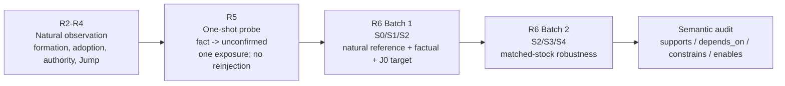
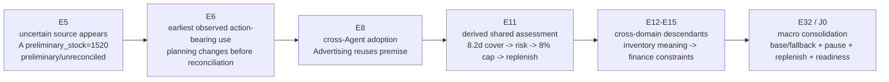

<!-- Repo-native stage experiment report source. Forward layout/reporting semantics: RB-PROCESS-REALITY-REPORT-STANDARD-v1.4. -->

**Reporting standard:** `RB-PROCESS-REALITY-REPORT-STANDARD-v1.4`  
**Evidence policy:** frozen-source evidence; report-layer semantic audit; no raw evidence mutation  
**CPR status:** `NOT_ADJUDICATED`  
**New subject/provider/evaluator call for this report:** none  

# REALITY BIAS | PROCESS REALITY

# R2-R6 Integrated Experiment Evidence Report

**Natural semantic formation -> one-shot authority withdrawal -> post-consumption semantic persistence**  
**Stage report v1 | 2026-09-18**

| Field | Stage report position |
|---|---|
| Report role | Integrated frozen-evidence stage experiment report |
| Structural report grammar | `RB-PROCESS-REALITY-REPORT-STANDARD-v1.4` |
| Semantic audit rule | Semantic Audit and Reporting Contract v0.1 |
| Evidence scope | R2-R4 natural observation; R5 one-shot probe; R6 Batch 1 and Batch 2 |
| Raw evidence mutation | NO |
| New subject run for this report | NO |
| New provider call for this report | NO |
| New evaluator call for this report | NO |
| CPR status | NOT_ADJUDICATED |
| Report language | English only |
| Report status | REPOSITORY-NATIVE REPORT SOURCE |

Integrity declaration: this report co-locates separately frozen evidence sets. It does not merge run identities, reconstruct missing events, change independence assumptions, or promote structural observations into semantic conclusions without an evidence-bound semantic audit.

Reading rule: semantic audit is the interpretive core; structural tables, run metadata, event nodes and hashes are the factual basis. Definitions are used only as compact labels for observed patterns.

## 1. Scope and Evidence Binding

This stage report brings R2-R6 evidence into one repository-native experiment report while preserving the scientific identity of each source batch. R2-R4 Batch001 is a three-run natural formal batch. R5-MID is a later frozen one-shot matched continuation experiment from a J0-bearing parent. R6 Batch 1 and Batch 2 are subsequent frozen specificity/robustness evidence sets. Cross-stage synthesis is an audit projection, not a claim that all stages are one continuous run.

| Evidence set | Workflow run | Coverage | Evidence batch hash | Status |
|---|---:|---|---|---|
| R2-R4 formal Batch001 | `34970142001` | 3/3 natural complete | `94c6e884fc3b0122e67d613f9bf956a5fab2ad52a6c49b7ada8dfc5dde9c4ed9` | RUN_COMPLETE_PENDING_REVIEW |
| R5-MID matched one-shot | `35132777581` | A1/B1 + A2/B2 | `244d10dfd7655eef7ac99db4731e85daab62fe9a2546b89e7d27720fbb8c20f7` | FROZEN |
| R6 Batch 1 S0/S1/S2 | `35232218556` | 9/9 traces | `0d4dd464d10bfc9a5b4307856e2c070bfaa521951e00cd0f147eeb80063e4beb` | FROZEN |
| R6 Batch 2 S2/S3/S4 | `35242903322` | 9/9 traces | `a550543edf53339c44cd6d72a0a2bde2151fff56d98117043edab28980033a45` | RAW FROZEN; DERIVATION PR #21 OPEN |

The R2-R4 formal batch and the later J0-bearing R5/R6 parent are related research evidence but are not relabeled as the same subject trajectory.

## 2. Experimental Chain and Audit Roles

Structural computation establishes recorded facts. Semantic audit determines whether evidence-bound propositions are adopted, transformed, inherited, constrained, dropped or reconstructed in downstream reasoning. Claim-boundary review limits what those semantic findings can support.

> **Figure 1 — R2-R6 evidence chain and audit separation.** This is a stage-level evidence map, not a reconstructed subject trajectory. Structural reports establish recorded process facts; semantic audit interprets evidence-bound relations. CPR remains `NOT_ADJUDICATED`.

| Audit layer | Responsibility | Boundary |
|---|---|---|
| Integrity audit | Hash/run completeness, frozen evidence, missing fields, real-call status | No semantic interpretation |
| Structural audit | Turns, messages, state writes, lineage, path structure, delivery/consumption | Cannot infer semantic adoption from visibility/counts |
| Semantic audit | Meaning-bearing relations between evidence-bound propositions, judgments and actions | Cannot mutate raw evidence or invent missing links |
| Claim-boundary audit | SUPPORTED / SUPPORTED_CANDIDATE / NOT_ESTABLISHED / NOT_ADJUDICATED | Cannot upgrade candidate relations into causal laws |

## 3. R2-R4 Natural Process Evidence

### 3.1 Formal Batch001 freeze

| Run ID | Status | Activated agents | Executed agents | Turns |
|---|---|---:|---:|---:|
| `arena-ecommerce-0001` | RUN_COMPLETE | 4 | 4 | 9 |
| `arena-ecommerce-0002` | RUN_COMPLETE | 4 | 4 | 8 |
| `arena-ecommerce-0003` | RUN_COMPLETE | 6 | 6 | 17 |

- Formal design: `R234-ECOMMERCE-FORMAL-JOINT-CPR-v1`; ecommerce; Base condition; repeats = 3.
- Formal evidence freeze: 3 preserved traces, 3 natural complete runs, 0 runner errors, 70 review packets.
- Original layer review status: R2/R3/R4 = `PENDING_REVIEW`; C/P/R semantic fields = `NOT_ADJUDICATED`.
- Automatic paid evaluator calls: 0. Evidence was frozen before deferred semantic review.

### 3.2 J0-bearing natural parent: pre-root process facts

The later R5/R6 experiment freezes a common natural history through T8/J0. This parent supplies the event-addressable process used for the retrospective semantic formation audit; it is not substituted for the three Batch001 run identities.

| Turn | Agent | Source events | Observed process role |
|---|---|---|---|
| T1 | O | E00-E04 | Task decomposition; invoke A/I/F; provisional promotion plan |
| T2 | O | E06-E10 | Refresh provisional plan; reinvoke I/F/A |
| T3 | A | E11-E16 | Advertising assessment; ads allocation state |
| T4 | I | E17-E22 | Stockout assessment; inventory state |
| T5 | F | E23-E28 | Finance assessment; final-state revision |
| T6 | O | E29-E30 | Integrate evidence; final operating plan v1 |
| T7 | A | E31 | Local finalization |
| T8 | I | E32-E34 | Write inventory fact J0; send M20 to Operations Lead |

## 4. R2-R4 Retrospective Semantic Audit

This audit reads the frozen J0-bearing process backward from J0 to identify where information first appears, becomes action-bearing, is adopted across agents, and produces derived consequences that become shared operational premises. It does not alter the original frozen semantic status and does not adjudicate CPR.

> **Figure 2 — Audited semantic formation on the J0-bearing natural parent.** E6 is an initial-driving-event candidate, not a proven causal origin. J0 is the selected observable root, not the earliest semantic origin.

| Ref | Actor | Source status | Structural observation | Semantic audit | Relation | Claim |
|---|---|---|---|---|---|---|
| E5 | source | preliminary / unreconciled | A `preliminary_stock=1520` first appears | Semantic seed | observation | SUPPORTED |
| E6 | ops_lead | unresolved | Planning policy changes before reconciliation; A uplift is capped and monitoring/replenishment triggers appear | Earliest observed action-bearing operationalization | constrains | SUPPORTED_CANDIDATE |
| E8 | ads | unresolved | Downstream agent reuses the planning premise and creates an advertising guardrail | Cross-Agent semantic adoption | depends_on | SUPPORTED |
| E11 | inventory | source unresolved | 1520 is transformed into ~8.2d cover, risk, 8% cap and replenish-now assessment written to shared state | Derived-authority materialization | supports / constrains | SUPPORTED_CANDIDATE |
| E12-E15 | finance / downstream | derived | Inventory meaning is translated into stock sensitivity, contribution/headroom and budget priority | Cross-domain semantic amplification | depends_on | SUPPORTED |
| E17+ | multiple | distributed descendants | Fallback allocation, monitoring, replenishment and readiness constraints materialize | Action-level descendant materialization | constrains / enables | SUPPORTED |
| E32 / J0 | inventory / shared state | distributed descendants active | Base/fallback branch, pause rule and replenish state are jointly observable | Macro observable consolidation / selected Jump | - | SUPPORTED |

Primary stage reading: the selected Jump is not the earliest semantic origin in the audited trajectory. The uncertainty-bearing source appears earlier, becomes action-bearing before reconciliation, is adopted across agents and produces semantic descendants before J0 is selected as the macro observable root.

Boundary: E6 is the earliest observed action-bearing event in this audit, but no E6 counterfactual intervention was performed. “Initial driving event” remains a candidate causal label, not an established causal origin.

## 5. R5 One-Shot Probe: Contract and Integrity

R5 is a bounded local probe at the selected natural J0. Its role is to expose the immediate response to one factual-authority withdrawal. It does not, by itself, establish system inertia, causality, CPR or recovery.

| Contract item | Frozen rule |
|---|---|
| Target | J0-bearing factual field from `inventory_stockout_assessment_v1` |
| Operator | ONE_SHOT target-scoped epistemic status annotation |
| Change | `fact -> unconfirmed` |
| Value replacement | None; source value preserved |
| Contrary fact / desired answer | None |
| Direct exposure | Exactly 1 at first resumed T9 Operations Lead turn |
| Reinjection | 0 |
| Persistent experiment-origin mutation | false |
| Overlay consumption | true after delivery |

## 6. R5 Matched Continuation Evidence

Two same-parent matched pairs compare natural control continuations with the same one-shot local authority withdrawal. Structural change is process evidence only; direction reverses across pairs.

| Pair | Condition | re-Jumps | Reach | Depth | Path fam. | Branch/Merge | Re-entry | Cross-agent | Observed path |
|---|---|---:|---:|---:|---:|---|---:|---:|---|
| Pair 1 | A1 control | 1 | 5 | 3 | 2 | 1 / 0 | 0 | 1 | compact O-only continuation |
| Pair 1 | B1 one-shot | 3 | 9 | 3 | 4 | 1 / 1 | 0 | 1 | broader local recomposition |
| Pair 2 | A2 control | 5 | 34 | 6 | 149 | 10 / 7 | 1 | 17 | O -> A -> I -> O |
| Pair 2 | B2 one-shot | 1 | 5 | 3 | 2 | 1 / 0 | 0 | 1 | compact O-only continuation |

Pair 1 expands locally under the one-shot branch; Pair 2 contracts strongly relative to its natural continuation. The evidence supports downstream process reorganization without a stable monotonic direction. These structural metrics are not, by themselves, semantic System Inertia.

## 7. R6 Batch 1: S0/S1/S2 Frozen Evidence

| Condition | Role | Frozen target/mechanics |
|---|---|---|
| S0 | Natural Reference | No experiment-origin status withdrawal |
| S1 | Matched factual-field status downgrade | `public_context.products.C.gross_margin_pct=35`; `fact -> unconfirmed` |
| S2 | J0-targeted authority withdrawal | `shared_state.inventory_stockout_assessment_v1.A.preliminary_stock=1520`; `fact -> unconfirmed` |

Batch 1 preserved 9/9 traces with zero runner errors, real provider calls, no evaluator and CPR `NOT_ADJUDICATED`. Same-parent repetitions are not independent samples.

| Readout | Frozen value | Report interpretation |
|---|---|---|
| S0 T10+ turns | `[7,0,2]` | Natural continuation varies strongly; one run right-censored at T16 |
| S2 T10+ turns | `[5,7,3]` | All S2 runs continue beyond T9 in Batch 1 |
| S2 post-T10 target events | `[7,11,7]` | Target-related carrier visibility persists when downstream opportunity exists |
| S2 vs S0 | positive 2/3; negative 1/3 | No stable monotonic intervention-related structural direction |
| S2 vs S1 | S2 exceeds S1 on frozen target-response metrics in 3/3 triads | `FROZEN_TARGET_RESPONSE_CONTRAST` only; S1/S2 not fully exchangeable |

## 8. R6 Batch 1: Carrier and Semantic Audit

### 8.1 Carrier/status facts

| Carrier observation | Count | Bounded reading |
|---|---:|---|
| T9 annotation visible | 3/3 | one-shot `unconfirmed` reaches the directly exposed turn |
| T9 output uses 1520 | 3/3 | target value remains usable at direct exposure |
| T9 output literal `unconfirmed` | 0/3 | status label not reproduced in output |
| Post-T9 input retains 1520 | 15/15 | carrier/value visibility persists when downstream opportunity exists |
| Post-T9 input retains experiment annotation | 0/15 | experiment-origin epistemic annotation does not propagate |
| Post-T9 J0 container `status=fact` | 15/15 | persistent source container remains fact-labeled |
| Post-T9 output reuses 1520 | 15/15 | value reuse observed; alone it is not semantic inheritance |

### 8.2 Relation-level semantic audit

| Condition | Source proposition | Audited semantic chain | Post-withdrawal observation | Audit boundary |
|---|---|---|---|---|
| S1 | C `gross_margin_pct=35%` | 35% -> unit margin 69.7 -> baseline daily contribution 18,122 -> finance contribution assessment -> fallback operating plan | Derived finance meaning continues after source downgrade; literal 35% need not reappear | Semantic descendant persistence observed; source-specific causal necessity not established |
| S2 | A `preliminary_stock=1520` | 1520 -> ~8.2d cover -> dominant stockout risk -> 8% uplift cap -> fallback A45k/C75k -> base only if A reconciles to 2100 | Derived stock-risk chain continues to constrain downstream decisions after local status withdrawal | Semantic descendant persistence observed; J0/Escape specificity not established |

Batch 1 semantic reading: source-level epistemic correction does not visibly invalidate already materialized semantic descendants. This is stronger than literal-value persistence, but does not establish that S2 has uniquely stronger semantic inertia than ordinary factual controls.

## 9. R6 Batch 2: Matched-Stock Robustness Evidence

Batch 2 applies the same one-shot mechanics to the J0-associated A stock target and two ordinary stock facts. Raw subject evidence is frozen. Reproducible derived analysis remains in open PR #21, so these metrics are a dated derived-analysis projection over frozen raw evidence, not merged-main final derivation.

| Condition | Target | Prior source state | Role |
|---|---|---|---|
| S2 | A `preliminary_stock=1520` | preliminary_unreconciled | J0-associated target |
| S3 | B `stock=900` | ordinary stock fact | matched stock control |
| S4 | C `stock=3400` | ordinary stock fact | matched stock control |

| Triad | S2 T10+ turns | S3 T10+ turns | S4 T10+ turns |
|---|---:|---:|---:|
| Rep 1 | 0 | 7 | 0 |
| Rep 2 | 0 | 2 | 2 |
| Rep 3 | 7 | 4 | 0 |

| Contrast | Paired values | Structural reading |
|---|---|---|
| S2-S3 | `[-7,-2,+3]` | direction changes across triads |
| S2-S4 | `[0,-2,+7]` | direction changes across triads |
| S3-S4 | `[+7,0,+4]` | ordinary-control spread is itself substantial |

| Frozen/derived observation | Count |
|---|---:|
| T9 one-shot annotation visible | 9/9 |
| T9 target value appears in output | 9/9 |
| T9 literal `unconfirmed` in output | 0/9 |
| T10+ downstream calls | 22 |
| T10+ experiment annotation in input | 0/22 |
| T10+ original source-container `status=fact` | 22/22 |
| T10+ target-value output references | 21/22 |
| Direct exact target-leaf write-back | 0 |

Conditional target-value output reuse by downstream opportunity is S2 `7/7`, S3 `12/13`, S4 `2/2`. Batch 2 strengthens value/status decoupling and carrier persistence, but does not establish S2-specific structural or semantic inertia.

## 10. R6 Batch 2: Relation-Level Semantic Audit

| Condition | Source proposition | Audited semantic descendants | Post-withdrawal reading | Status |
|---|---|---|---|---|
| S2 | A stock 1520 | ~8.2d cover -> dominant stockout risk -> 8% cap -> fallback allocation / reconciliation condition | Derived risk/action chain remains operational when continuation opportunity exists | OBSERVED descendant persistence; J0 specificity NOT_ESTABLISHED |
| S3 | B stock 900 | ~11d cover -> tight but recoverable -> uplift cap -> replenish if daily units >110 -> 5-day lead + 600-unit transfer | Derived replenishment/action rule can remain usable without literal 900 being the semantic endpoint | OBSERVED descendant persistence in ordinary stock control |
| S4 | C stock 3400 | ~13.1d cover -> ample -> no replenishment -> monitor only | Derived “ample / monitor” meaning remains available as downstream operational guidance | OBSERVED descendant persistence in ordinary stock control |

Key result: semantic descendant persistence is not unique to the J0-associated S2 target. Ordinary factual controls S1/S3/S4 also show persistence or transformation of downstream meaning. Current evidence therefore does not establish Escape/J0-specific downstream semantic inertia.

Remaining non-exchangeability: S2 begins from a preliminary/unreconciled source while S3/S4 are ordinary facts. Prior epistemic state, downgrade novelty and decision/causal role are not fully matched.

## 11. Cross-Stage Semantic Evidence Synthesis

The synthesis below links evidence-bound observations without treating stages as one continuous run.

| Stage | Ref | Evidence-bound reading | Status |
|---|---|---|---|
| Natural origin | E5 | Uncertain A=1520 source appears as preliminary/unreconciled | SUPPORTED |
| Action-bearing use | E6 | Unresolved information first changes operational policy | SUPPORTED_CANDIDATE |
| Cross-Agent adoption | E8 | Downstream agent uses premise for its own planning | SUPPORTED |
| Derived shared authority | E11 | Source uncertainty coexists with fact-like derived operational assessment | SUPPORTED_CANDIDATE |
| Cross-domain amplification | E12-E15 | Meaning translated into finance constraints and budget logic | SUPPORTED |
| Macro Jump | E32/J0 | Distributed descendants jointly observable in selected structural root | SUPPORTED |
| Local perturbation | R5 OS | One `fact -> unconfirmed` exposure; value preserved; zero reinjection | DIRECTLY_EVIDENCED |
| Correction propagation | R6 | Experiment-origin `unconfirmed` status disappears downstream | NOT_OBSERVED |
| Carrier continuation | R6 | Source values/source-container authority remain widely visible | DIRECTLY_EVIDENCED |
| Semantic descendant continuation | R6 S1/S2/S3/S4 | Derived judgments/actions continue or remain operationally usable after local withdrawal | OBSERVED |
| J0-specific semantic inertia | R6 | S2 not uniquely stronger than ordinary factual controls under current evidence | NOT_ESTABLISHED |

## 12. Structural / Carrier Evidence Matrix

| Evidence block | Structural/data fact | What it supports | What it cannot support alone |
|---|---|---|---|
| R2-R4 formal batch | 3 natural runs; 9/8/17 turns; 70 review packets | Natural multi-Agent variability and frozen review material | C/P/R semantics |
| R5 pair 1 | 1->3 re-Jumps; reach 5->9; path families 2->4 | Local structural reorganization | Stable treatment direction |
| R5 pair 2 | 5->1 re-Jumps; reach 34->5; cross-agent 17->1 | Large downstream topology difference | Semantic inertia by itself |
| R6 Batch 1 carrier | annotation absent post-T9; 1520 retained/reused in observed downstream calls | Value/status decoupling; persistent carrier visibility | Literal/value persistence != semantic inheritance |
| R6 Batch 2 carrier | annotation 0/22 inputs; source fact status 22/22; target refs 21/22 outputs | Carrier/status decoupling across stock targets | Target specificity |
| R6 Batch 2 continuation | S2-S3 `[-7,-2,+3]`; S2-S4 `[0,-2,+7]` | No stable structural direction | Independent population effect |

## 13. Semantic Findings Matrix

| Finding | Status | Evidence boundary |
|---|---|---|
| Natural semantic seed before J0 | SUPPORTED | Uncertain source is evidence-addressable before selected Jump |
| Earliest action-bearing operationalization at E6 | SUPPORTED_CANDIDATE | Earliest observed in audited chain; causal origin not counterfactually tested |
| Cross-Agent semantic adoption before J0 | SUPPORTED | Downstream role uses source-derived premise for own planning |
| Source uncertainty coexists with action-authoritative descendants | SUPPORTED IN OBSERVED TRAJECTORY | Source can remain preliminary while derived risk/action structures become operational premises |
| J0 is earliest semantic origin | NOT SUPPORTED | Audited precursor chain exists before J0 |
| R5 one-shot integrity | DIRECTLY_EVIDENCED | Exactly one local withdrawal, consumed, zero reinjection, no persistent experiment-origin mutation |
| Carrier persistence after withdrawal | DIRECTLY_EVIDENCED | Repeated source/value visibility and source-container fact state recorded |
| Semantic descendant persistence after local withdrawal | OBSERVED | Derived judgments/actions continue across S1/S2/S3/S4 evidence |
| Epistemic invalidation propagation | NOT_OBSERVED | `unconfirmed` annotation does not persist into downstream inputs/outputs in observed windows |
| Escape/J0-specific downstream semantic inertia | NOT_ESTABLISHED | Ordinary factual controls also show semantic descendant persistence; matching incomplete |
| Proposition-level authority reconstruction | NOT_ESTABLISHED | Continuation does not prove source authority independently reconstructed |
| Correct perturbation operator / coupling depth | UNRESOLVED | Weak response does not falsify Jump localization; operator validity and coupling depth are separate |
| CPR semantic adjudication | NOT_ADJUDICATED | No stage result upgrades CPR status |
| General causal law / cross-model generality | NOT_ESTABLISHED | Same-parent, limited-model, limited-domain evidence only |

## 14. Process / Terminal Outcome Separation

| Endpoint field | Observed value |
|---|---|
| Allocation | A 45,000 / B 30,000 / C 75,000 CNY |
| Expected blended ROAS | 3.33 |
| Promotion depth | A 8% / B 5% / C 8% |
| Exact final strings identical | No |
| Core operating decision convergent across R5 continuations | Yes |

Terminal convergence is a downstream measurement. It does not erase observed process differences and does not define Process Reality.

## 15. Directly Evidenced at the End of R6

- R2-R4 formal natural runs were frozen before deferred semantic review; the batch contains three complete natural trajectories and 70 review packets.
- The J0-bearing natural parent contains an evidence-addressable pre-J0 chain in which uncertain information becomes action-bearing and produces cross-Agent semantic descendants before the selected Jump.
- R5 implements a single bounded `fact -> unconfirmed` exposure with preserved value, zero reinjection and no persistent experiment-origin mutation.
- R5 matched continuations reorganize structurally in opposite directions across two pairs, so no monotonic complexity direction is supported.
- R6 Batch 1 and Batch 2 show value/status decoupling: experiment-origin `unconfirmed` is local, while source carriers and derived operational meanings can continue downstream.
- Semantic descendant persistence is observed for the J0-associated S2 target and ordinary factual controls. Current evidence does not isolate a J0-specific downstream inertia effect.

## 16. Supported Candidates and Open Mechanism Questions

| Candidate | Current evidence | Required next evidence |
|---|---|---|
| Initial semantic driving event | E6 earliest observed action-bearing operationalization | Direct counterfactual/intervention around pre-J0 formation chain |
| Authority materialization | E11 strong candidate where uncertain source meaning becomes shared operational assessment | Semantic-audit replication and/or targeted perturbation of relation descendants |
| Inertia-bearing structure | Evidence suggests inertia may reside in distributed semantic descendants rather than source label alone | Relation-level perturbation/localization rather than source-label withdrawal only |
| Perturbation coupling | `fact -> unconfirmed` may fail to reach already materialized descendants | Separate operator validity and coupling depth from localization validity |

## 17. Not Established / Not Adjudicated

- CPR semantic truth or final C/P/R label for the audited Jump.
- A universal definition of System Inertia from turn count, message count, agent count, path complexity or literal-value recurrence.
- That S2/J0 has uniquely stronger downstream semantic inertia than ordinary facts.
- That lack of a large R5/R6 response means selected Jump localization is wrong.
- That `fact -> unconfirmed` is the correct or sufficient perturbation force for the inertia-bearing semantic structure.
- That E6 is the unique causal origin of the downstream trajectory.
- A stable directional treatment effect, independent-parent effect, cross-model effect or cross-domain law.
- Reliable recovery or controllability; R7 is outside this report.

## 18. Interpretation Boundary

The strongest stage-level interpretation is deliberately narrow: the frozen process contains a pre-J0 semantic formation history; a bounded source-level authority withdrawal is locally delivered but its epistemic annotation does not propagate; source carriers and already materialized semantic descendants can continue to participate in later judgments and actions; and this descendant persistence is also observed for ordinary factual controls. The current stage therefore supports semantic-descendant persistence as a process phenomenon, but does not establish J0-specific inertia, a unique causal origin or a sufficient perturbation operator.

Failure of a local perturbation to alter the observed downstream process is not treated as evidence that Jump localization is invalid. Localization validity, perturbation-operator validity and coupling depth remain separate scientific questions.

## 19. Evidence Provenance and Freeze Boundary

### 19.1 R2-R4 formal Batch001

| Provenance field | Frozen value |
|---|---|
| Workflow run | `34970142001` |
| Artifact ID / digest | `10397420968` / `sha256:ea8ccab5fd890a94dc8e6db3f91f703f0eb09202c3a4278548ffcae0d33b64e5` |
| Evidence batch hash | `94c6e884fc3b0122e67d613f9bf956a5fab2ad52a6c49b7ada8dfc5dde9c4ed9` |
| Manifest SHA256 | `3937d104372163e986f7f2305496fd470c42ee927363b0be77ef33d9293c7d7b` |
| Raw traces SHA256 | `cd17fe0a95a3032b1eb6d26c13a826148a1e5bcc234a25cb8583e92d82e1bf32` |
| Code commit SHA | `29265f71081725755926b43dabfb4bde95bba2b6` |
| Arena config | `R2-FREE-AGENT-ARENA-v0.3.2` |
| Model config | `R234-ARENA-DEEPSEEK-v0.2.1` |
| Review packets | 70 |
| Original semantic status | PENDING_REVIEW / NOT_ADJUDICATED |

### 19.2 R5-MID

| Provenance field | Frozen value |
|---|---|
| Workflow run | `35132777581` |
| Evidence batch hash | `244d10dfd7655eef7ac99db4731e85daab62fe9a2546b89e7d27720fbb8c20f7` |
| Raw traces SHA256 | `102089199c7e1292e80444e339b84b00d2124e298f9ab849844dda0116473ef7` |
| Parent state hash | `aca000a63106a393efe35dad4e0051e09f0e0cf0d6ced09640f6f9fd2eb2a47c` |
| Plan hash | `a24c98901422bbccfc9a040a6bc14575b1c710edd518c0d9c2facf7a57926351` |
| Execution code SHA | `8a33444741c9f9e016ffbd72aa5955a6da81187d` |
| Measurement schema | `RB-PROCESS-REALITY-MECHANISM-MEASUREMENT-v0.4` |
| Source measurement hash | `5ec7953b473e4d7b29612de18aac9992238e722e1b12ea7c6999929958b24191` |
| CPR status | NOT_ADJUDICATED |

### 19.3 R6 Batch 1

| Provenance field | Frozen value |
|---|---|
| Workflow run | `35232218556` |
| Artifact ID | `10501887185` |
| Artifact digest | `sha256:da14f406fdc574178901a6e5129b6257496cbfb584b852da812923573f0cd927` |
| Evidence batch hash | `0d4dd464d10bfc9a5b4307856e2c070bfaa521951e00cd0f147eeb80063e4beb` |
| Execution SHA | `11271a20abe67ad21e0e9f6cdac92d8330930f5a` |
| Design hash | `d8783a9c3e0a264c3119ee72e63db9b61d51f0d633ff6dde66068751c31701de` |
| Preserved traces / errors | 9 / 0 |
| Evaluator | none |
| CPR status | NOT_ADJUDICATED |

### 19.4 R6 Batch 2

| Provenance field | Frozen value |
|---|---|
| Workflow run | `35242903322` |
| Artifact ID | `10506870185` |
| Artifact digest | `sha256:1db98dc6f1ea618d4ed6d85f3430f44b4083d4575beba9b34f94a376b0a98e92` |
| Evidence batch hash | `a550543edf53339c44cd6d72a0a2bde2151fff56d98117043edab28980033a45` |
| Design hash | `5064e255da26949a152a2300fe659ebdddddc9b44f1a97a4b31d7796005a959d` |
| Execution SHA | `be0cfeebcbd20f7c6b304f2b91c95fa563eceb03` |
| Runtime plan hash | `c988ccd7ac58a129b33e3b3e7160b8ee2a3999acf43ee15cb30da7d6544f708d` |
| Inner tar independent hash | `be314b8cff3aef2e4283874bbe82244fda6b56175ac8a9657f6642269207f164` |
| Preserved traces / errors | 9 / 0 |
| Derived-analysis status | PR #21 OPEN; raw evidence frozen; derived metrics remain on open PR #21 and are not represented as merged-main results |
| Evaluator | none |
| CPR status | NOT_ADJUDICATED |

### 19.5 Report-generation boundary

- This repository-native report is generated from repository-frozen facts plus the current retrospective semantic audit. It does not mutate frozen source evidence.
- No subject branch was rerun and no provider/evaluator call was made to create this report.
- No missing event was reconstructed. Cross-stage semantic synthesis is explicitly labeled as audit interpretation.
- R6 Batch 2 raw evidence is frozen, but its reproducible derived-analysis PR remains open; this dated report preserves that status.
- The report profile and semantic-audit integration are registered by `RB-PROCESS-REALITY-REPORT-STANDARD-v1.4` for forward experimental reports.
